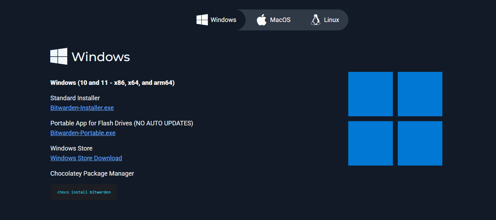
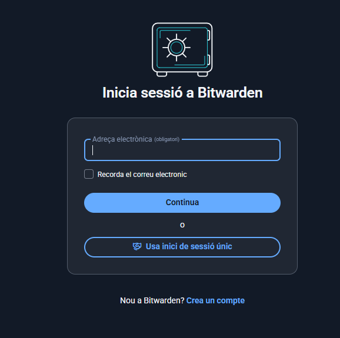
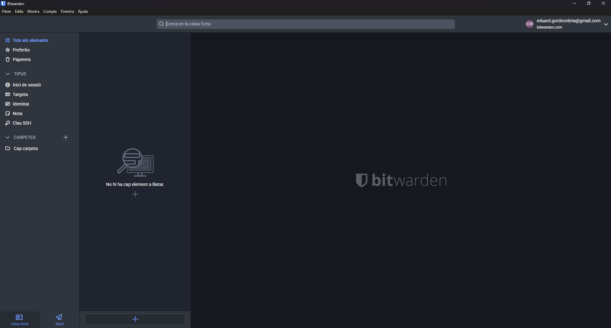
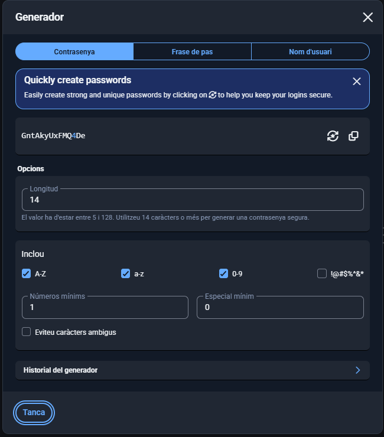
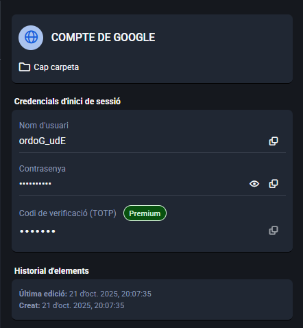
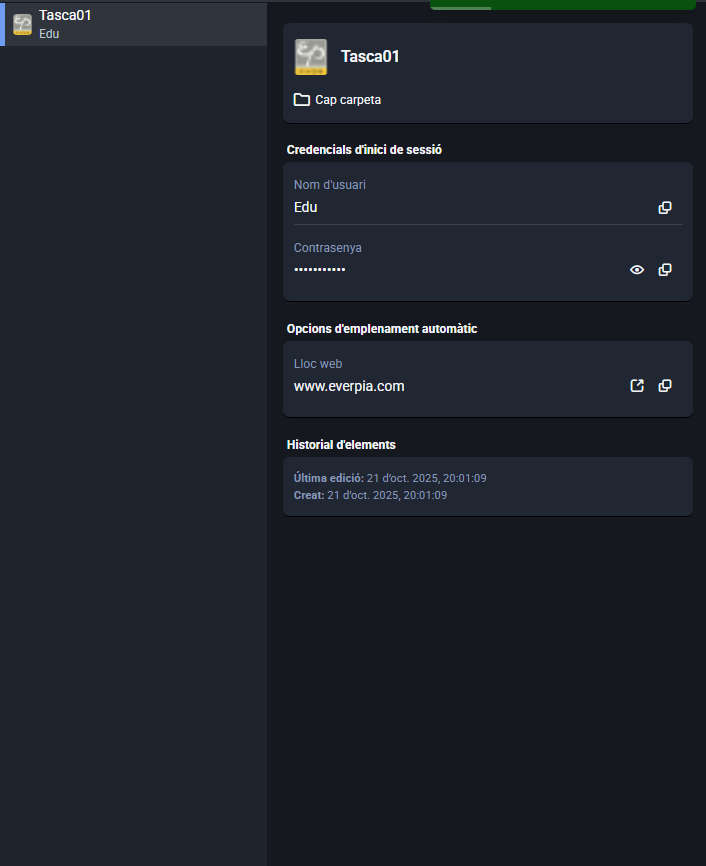
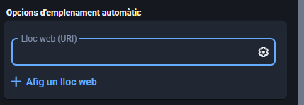

# **T01 \- Gestor de contrasenyes** 🔐🗝️

---

**Fase 1: Anàlisi i Justificació (Document d'Informe)**  
Heu de redactar un informe que justifiqui tècnicament la decisió de la Direcció i comparin les opcions. Aquest informe ha d'incloure:

1. 📘📝 Introducció i Justificació:  
* Les contrasenyes reutilitzades i/o febles permeten que els ciberatacants que vulguin accedir a la conte tinguin la feina molt més fàcil a l’hora d’intentar accedir dins d’un compte. Utilitzen diferents maneres com l’atac de diccionari que consisteix en crear un diccionari de columnes amb els caràcters més comuns utilitzats per després provar combinacions fins encertar. el credential stuffing, es un sistema que funciona utilitzant les mateixes contrasenyes ja desxifrades en altres llocs aprofitant que molta gent sol reutilitzar-les.  
* La funció principal d’un gestor de contrasenyes bàsicament es el de guardar contrasenyes molt fortes per tal que la gent no hagi de recordarles i només hagi d’accedir al gestor per entrar amb les credencials correctes. El gesto les emmagatzema de tal manera que queden completament capades i no s’hi pot accedir a menys que es tingui el compte del gestor.  
2. ⚙️📊 Comparativa Tècnica: Realitzeu una taula comparativa detallada entre:  
   

| Bitwarden |  |
| ----- | :---- |
| Sincronització | Núvol amb sincronització automàtica |
| Model de seguretat | Algoritmes de xifratge, contrasenyes encriptades, seguretat de codi obert |
| Accés de múltiples dispositius | Multiplataforma |
| Freemium | Dispositius ilimitats, Gestió de claus d’accés, Funcions bàsiques |

| KeePassX / KeePass XC |  |
| ----- | :---- |
| Emmagatzematge local de l’arxiu | Es guarden en un arxiu que es pot emmagatzemar en qualsevol disc local, extern i intern |
| Independència del núvol | No, tenen una copia local independent |
| Model open source | Codi obert, auditories independents de seguretat |
| Portabilitat de l’arxiu | Fitxer únic, accés multiplataforma (amb el fitxer), portabilitat física (USB, dispositius portàtils…) |

 

3. 👍/👎Avantatges i Inconvenients: Resumiu els principals pros i contres de cada model (online vs. offline) des del punt de vista de seguretat, usabilitat i continuïtat del negoci.  
     

|      | Bitwarden                          | KeePassX                          |
|---------------|----------------------------------|----------------------------------|
| **Avantatges** | Seguretat robusta                 | Control total sobre les dades    |
|               | Sincronització automàtica         | Portabilitat                     |
|               | Model de preus flexible            | Model open source                |
| **Inconvenients** | Dependència de la connexió a internet | Sincronització manual           |
|               | Risc de compromís extern           | Dependència de còpies de seguretat locals |
|               | Funcionalitats limitades en el pla gratuït | Limitada funcionalitat en dispositius mòbils |

4. ✅💡Recomanació: Concloeu l'informe escollint l'eina que considereu més adequada per al personal tècnic de l'empresa i justifiqueu la vostra elecció.

- La meva elecció es Bitwarden, que per el tipus d’empresa on el volem utilitzar es força adequat per a organitzacions que busquen una solució escalable i amb funcionalitats avançades.

**Fase 2: Guia d'Ús Tècnica (Manual Operatiu)**

Utilitzant l'eina que heu seleccionat a la Fase 1 (Bitwarden, KeePassX, o similar), heu de crear una Guia d'Ús per a l'Equip Tècnic. Aquesta guia ha de ser clara i basada en captures de pantalla i instruccions pas a pas.

La guia ha de cobrir els següents punts obligatoris:

1. 🛠️⚙️ Instal·lació i Configuració Inicial: Descàrrega, instal·lació i creació de la BBDD principal o compte mestre.

2. 🔑🧰 Per generar una contrasenya amb Bitwarden o KeePassXC, obre el **generador de contrasenyes** de l’eina. Tria la **longitud** (es recomana almenys 12–16 caràcters) i activa **majúscules, minúscules, números i caràcters especials** per fer-la més segura. Pots copiar-la directament per utilitzar-la o guardar-la a la teva “vault” de contrasenyes.

3. 📂🤖 Exemples d'Ús i Emplenament Automàtic:  
* Com desar una credencial d'un compte de correu electrònic.  
    
* Com desar una credencial d'una aplicació o servei web.  
  
* Com fer servir l’extensió del navegador per emplenar automàticament les dades.  
    
4. 💾🔄 Gestió de Còpies de Seguretat (Backup):

* Per fer una còpia de seguretat a KeePassXC, has d’obrir la base de dades KDBX i desar una còpia del fitxer en un dispositiu segur com un USB o un disc dur xifrat. És important guardar diverses còpies actualitzades i protegir-les amb la contrasenya mestra. En Bitwarden, cal accedir al cofre web, anar a configuració i utilitzar l’opció d’exportar dades per guardar un fitxer JSON o CSV en un lloc segur. Aquest fitxer ha d’estar xifrat o emmagatzemat amb seguretat i, si no és necessari, s’hauria d’esborrar després per evitar riscos.

* La millor pràctica per emmagatzemar còpies de seguretat és utilitzar una clau USB xifrada o un dispositiu d’emmagatzematge físic amb xifratge, assegurant que només persones autoritzades hi tinguin accés. També és possible fer servir emmagatzematge al núvol, però sempre amb fitxers xifrats prèviament per l’usuari, garantint que ni el proveïdor ni tercers puguin accedir a les dades. Així es manté la seguretat i la confidencialitat de la informació en cas de pèrdua o accés no autoritzat.
