# T03: Gestió flexible de discos (LVM i Espais d’emmagatzematge)

Primer de tot hem hagut de crear la màquina virtual i crear tres discos anomenat, disc01.vdi,disc02.vdi i disc03.vdi un cop creats aquest discos li cliquem a d’acord iiniciem la màquina i instalem el windows.

Aquí podem veure com s’ens està instal·lan el windows 11.

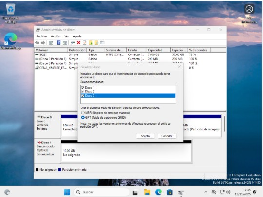

Un cop el windows instal·lat li donem click dret al ratolí adalt del windows i anem a administració de discos i tot està correctament ja estaran els discos inicialitzats. 

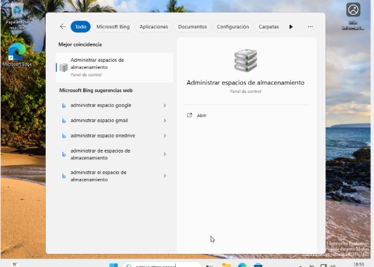

Un cop a dintre de la màquina al buscador busquem “administrar espacios de almacenamiento”

Dels tres discos ens hem de quedar amb 2 i l’ultim al desactivem.

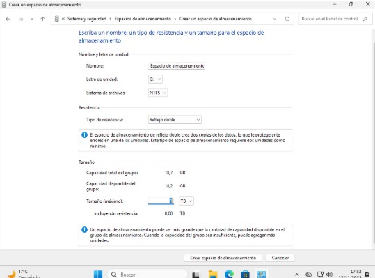

Creem un espai d’emmagatzematge de reflexa doble i jo he posat 4 TB

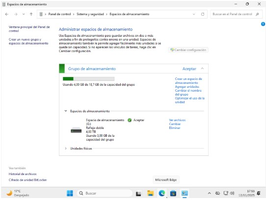

I ja hem creat al primer disc creat de reflex doble a la nostra màquina virtual. 

Un cop aixo obrim las carpetes de la màquina i a “este equipo” podem veure que tenim al disc sense res a dintre amb tots els TB disponibles. 

Dins del nostra disc haurem de crear un arxiu, i despres de crear-lo veurem com eliminan el disc l’arxiu segueix en al mateix lloc gracias al refelxa doble.

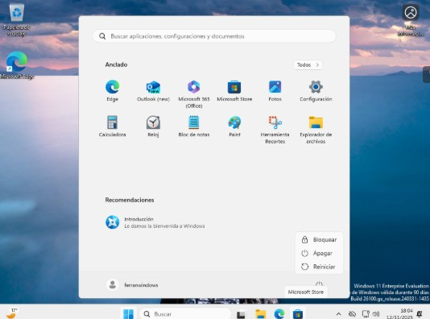

Apaguem la màquina virtual. 

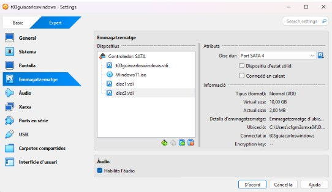

Eliminem el disc que nosaltres vulguem en el meu cas he eliminat el disc 2. 

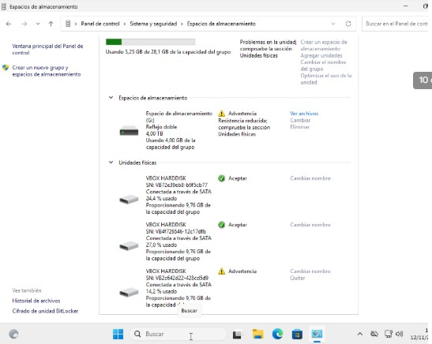

Entrem a la màquina i veurem com ens adverteix del disc que hem eliminat i com podem veure els tant per cent de cada disc veiem que no cada disc pot amagatzema igual que l’altre sino qu els que estan en advertencia tenen un tan per cnt menys d’emmagatzematge que els altres. 

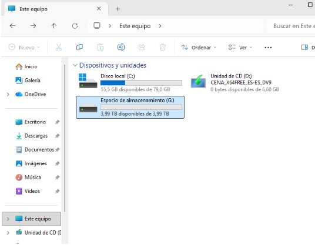

I un cop eliminat entrem a carpetes i podrem veure dintre del disc que segueix tot igualment que l’haguem eliminat. 

Aqui veiem com l’arxiu esta igual que abans. 

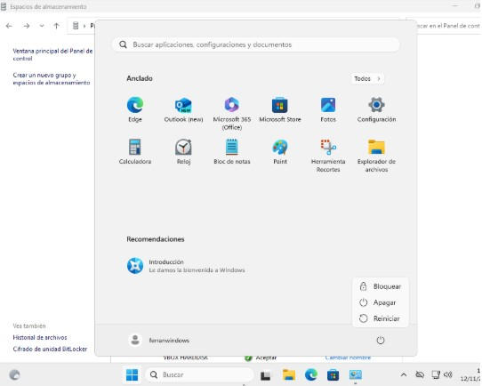

Tornem a apagar la màquina virtual una altra vegada. 

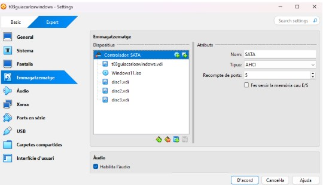

i tornem a afeigir al disc 2 per veure que quan el restableixes veure que està tot com al principi.

I efectivament està igual que al prinicpi de tot com podeu veure a la captura. 

I amb l’arxiu que segueix a dins del disc. 

entrem a administració de discos i elimin del tot al reflex doble. 

Com podeu veure ja l'he eliminat. 

Eliminem tot el grup de discos que teniem. 

I creem dos discos mes el disc4 i al disc5. 

un cop els creem ens surt inicialitzar discos li donem a acceptar

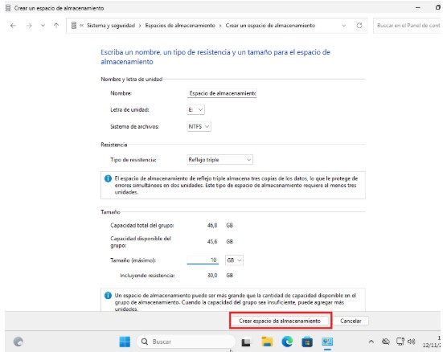

I creem un grup amb els 5 discos. 

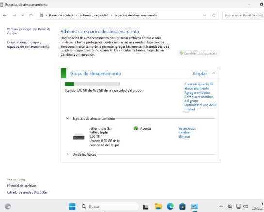

Un cop creat creem el refelxa triple. I li donem a crear espacio de almacenamiento. 

Aqui ja s’ens a creat al disc reflexa triple. 

I dintre del disc de reflexa triple jo he creat tres arxius aleatoris. Anomenats valorant,fortnite i spotify. 

Fem captura de tots els discos creats els 5 a la vegada. 

apaguem la màquina un altre vegada i borrem 2 discos jo he borrat al disc1 i al disc3

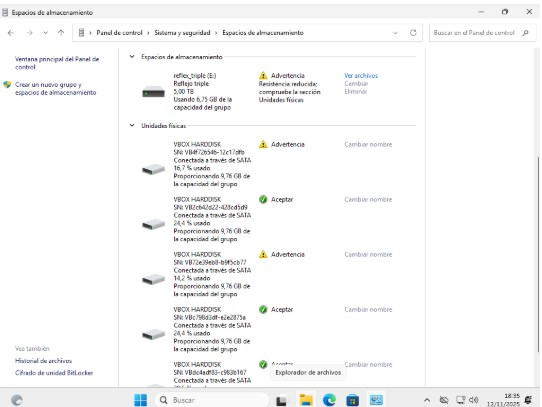

Entrem i ens surt advertencia en els discos borrats i ens passa al mateix que al principi, que els de advertencia tenen menys tan per cent de emmagatzematge que els altres. 

Un cop a dins de la màquina un altre vegada podem seguir veien que els arxius igualment que eliminis els discos es queden els tres al mateix lloc.
