## 🔄 LVM (Linux)

###IMPORTANT: Abans d'iniciar, haurem de crear dos particions de discos dins la màquina virtual en els paramentres

Instal·lem el lvm amb la comanda **"sudo apt install lvm2"**

---

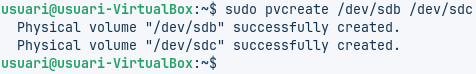

Per crear els volums físics utilitzaremm la comanda **sudo pvcreate** i crearem dos volums anomenats *sdb* i *sdc*

---

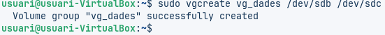

Amb la comanda **sudo vgcreate** crearem el grup *vg_dades* per ficar dins els volums **b i c** que hem creat anteriorment

---

Per crear el volum lògic amb mirall, el primer que haurem de fer serà crear-lo sense, normal. El crearem amb la comanda **sudo lvcreate**

---

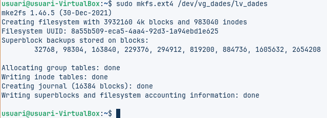

Amb la comanda **sudo mkfs.ext4** formatem el volum que hem creat anteriorment

---

Escrivim aquesta comanda **"sudo mkdir"** per crear el punt de muntatge

---

I després, amb la següent comanda; **sudo mount**, el muntarem

---

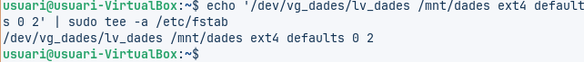

Amb aquesta comanda el que aconseguim es fer el muntatge automàtic editant ***/etc/fstab***

---

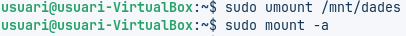

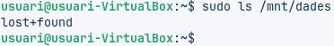

D'aquesta manera, amb les tres comandes de les fotografies farem la preva que tot estigui correctament

---

Apagarem al màquina i en els paràmetres afegirem 2 discos mes. Després, tornem a iniciar la màquina i la terminal

---

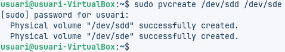

Afegim els nous discos al VG

---

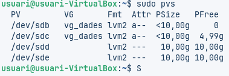

Comprovem que tot està creat correctament i ben organitzat

---

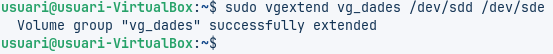

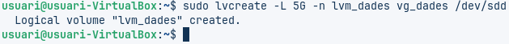

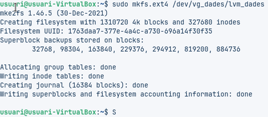

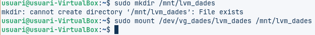

Tornem a crear un volum per les noves dades de la mateixa manera que ho hem fet amb la primera part

---

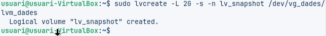

Creem l'*snapshot** amb **sudo lvcrate**

---

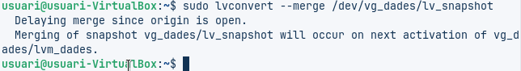

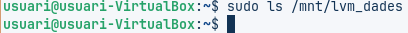

I restaurem l'*snapshot**

---

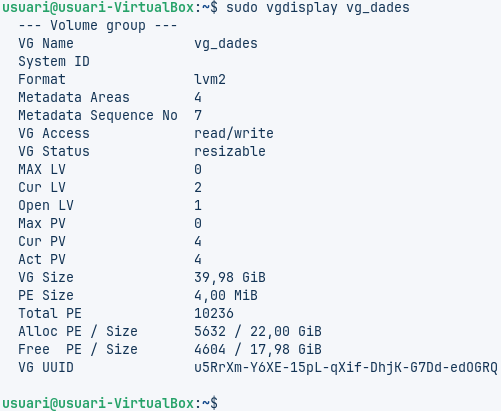

Per comprovar l'espai lliure en el VG utilitzem **sudo vgdisplay**

---

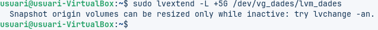

I d'aquesta manera podem ampliar el volum amb **sudo lvextend**

---

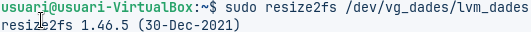

Redimensionem el sistema de fitxers amb **sudo resize2fs**

---

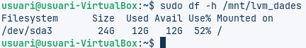

I per últim comprovem que el sistema s'ha redimensionat correctament

---

I amb aixo, la pràctica esta completa
