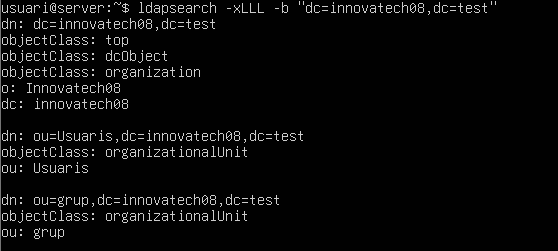
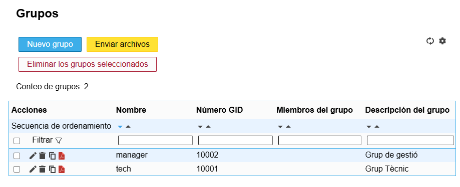
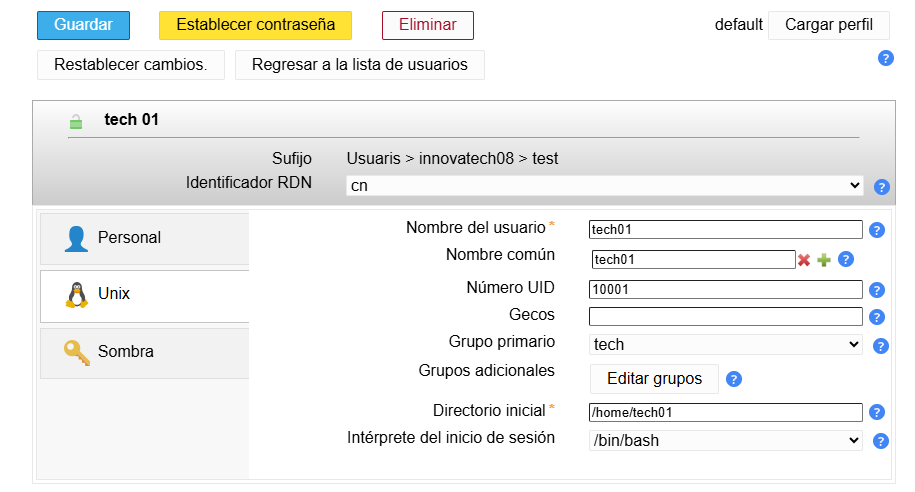
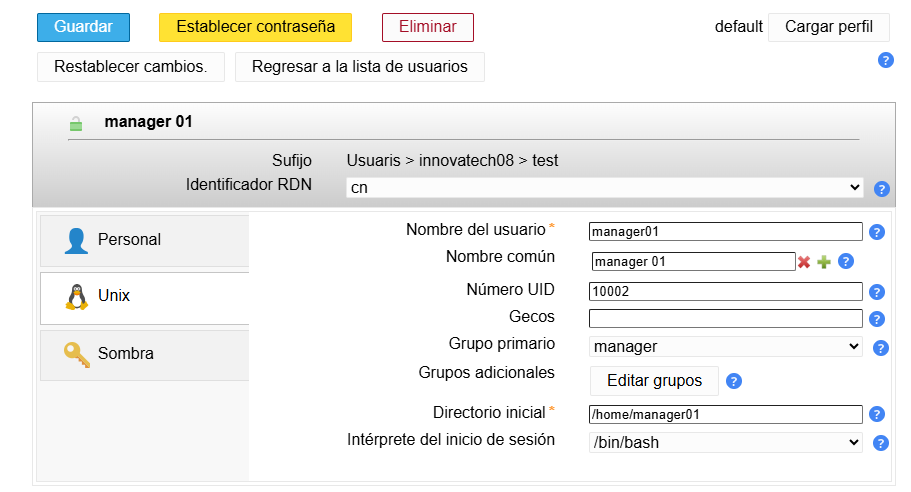

---

## **Plec de Condicions Tècniques (PCT)**

Projecte: Implementació del Servei de Directori LDAP per a Entorn de Proves Innovatech

Client (Beneficiari): Innovatech (Startup)  
Proveïdor (Consultora Tècnica): EverPia  
Data de Publicació: 17 d'octubre de 2025  
---

### **1\. Objecte de l'Encàrrec**

L'objecte del present Plec és la instal·lació, configuració i validació d'un servei **OpenLDAP** en un entorn virtualitzat basat en Ubuntu Server. Aquest servei s'ha de configurar per actuar com a directori centralitzat d'usuaris i grups per al domini de proves **innovatechXX.test**.

### **2\. Requeriments d'Infraestructura Inicial**

El consultor ha de verificar la correcta configuració de la infraestructura virtual abans d'iniciar la implementació:

| ID | Descripció del Requeriment | Configuració Requerida |
| :---- | :---- | :---- |
| **R.INF.01** | Configuració de la màquina Server (Server Hostname). | |
| **R.INF.02** | Interfície de Xarxa Pública. |  (Per accés a Internet i descàrrega de paquets). |
| **R.INF.03** | Interfície de Xarxa Privada. |  (Per a comunicació privada amb el Client virtual  i la màquina física). |

### 

### **3\. Tasques d'Implementació i Configuració del Servidor LDAP**

La Consultora EverPia ha de complir estrictament amb les següents tasques d'instal·lació i configuració:

#### **3.1. Instal·lació i Configuració Base d'OpenLDAP**

| ID | Descripció de la Tasca | Detalls de la Configuració |
| :---- | :---- | :---- |
| **T.LDAP.01** |Instal·lació del servei OpenLDAP. |  |
| **T.LDAP.02** | Configuració de la base de dades. |  |
| **T.LDAP.03** | Configuració de la contrasenya d'administrador. |  **Contrasenya:** p@ssw0rd|
| **T.LDAP.04** | Creació d'Unitats Organitzatives (OU) inicials. |  S'han de crear dues OUs: **users** i **groups** mitjançant un fitxer **.ldif**. |
| **T.LDAP.05** | Validació de les Unitats Organitzatives. |  Realitzar una consulta amb **ldapsearch** que mostri totes les OUs creades al directori. |

### **3.2. Gestió i Administració (LAM)**

| ID | Descripció de la Tasca | Detalls de la Configuració |
| :---- | :---- | :---- |
| **T.LAM.01** | Instal·lació del Gestor d'Usuaris LDAP (LAM). |  S'ha de documentar la comanda d'instal·lació. |
| **T.LAM.02** | Accés Remot i Configuració. |  Connectar a LAM des de la màquina física utilitzant l'adreça IP de la interfície **Host-Only**. |
| **T.LAM.03** | Configuració per defecte. |  Establir la configuració predeterminada perquè els nous usuaris s'ubiquin a l'OU **users** i els nous grups a l'OU **groups**. |
| **T.LAM.04** | Creació de Grups. |  Crear dos grups de seguretat al directori: **tech** i **manager**. |
| **T.LAM.05** | Creació d'Usuaris de Prova. |   Crear un usuari per a cada grup: **tech01** (membre de tech) i **manager01** (membre de manager). |

### **4\. Integració de Client (Client Ubuntu Desktop)**

| ID | Descripció de la Tasca | Detalls de la Configuració |
| :---- | :---- | :---- |
| **T.CLI.01** | Instal·lació del Client. | Instal·lar un client Ubuntu Desktop i configurar la interfície de xarxa per comunicar-se amb el servidor (Host-Only). |
| **T.CLI.02** | Resolució de Noms. | Configurar l'arxiu d'**hosts** del client per resoldre l'adreça IP del servidor a **server.innovatechXX.test**. S'ha de proporcionar una instantània (snapshot) de la màquina client un cop fet el canvi. |
| **T.CLI.03** | Validació de la Connectivitat LDAP. | Comprovar la connectivitat amb el servidor fent una consulta **ldapsearch** des del client. |
| **T.CLI.04** | Mòduls d'Autenticació. | Instal·lar els mòduls necessaris per permetre l'autenticació amb LDAP. |
| **T.CLI.05** | Configuració del Client. | Modificar els arxius de configuració del client necessaris. S'han de mostrar **clarament els canvis realitzats** en el codi dels arxius. |
| **T.CLI.06** | Comprovació del Sistema. | Reiniciar els serveis i verificar amb la comanda **getent passwd** que els usuaris del directori són visibles localment. |
| **T.CLI.07** | Prova d'Accés Final. | Reiniciar el client i iniciar sessió amb l'usuari **tech01**. Es requereix una captura de pantalla que demostri l'accés correcte i la **creació automàtica de la carpeta personal** de l'usuari. |

**Acceptació del Plec de Condicions Tècniques (PCC) \- EverPia**

| Per Innovatech (Client) | Per EverPia (Consultora) |
| :---- | :---- |
| **Nom:** | **Nom:** |
| **Signatura:** | **Signatura:** |
| **Data:** | **Data:** |

*(Nota: Substitueix **XX** pel número de llista corresponent abans de l'execució.)*

