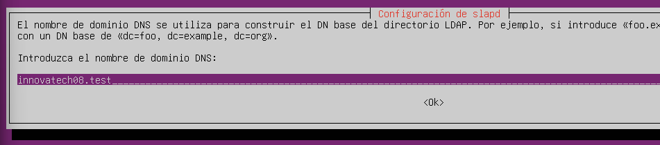
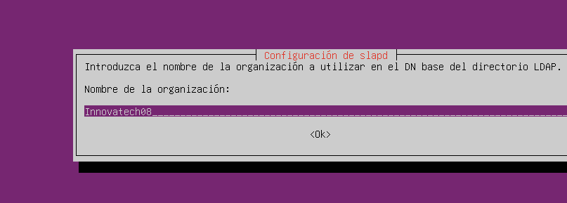
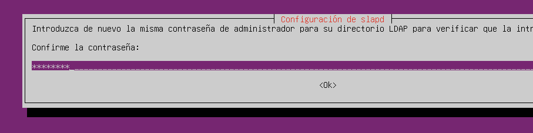
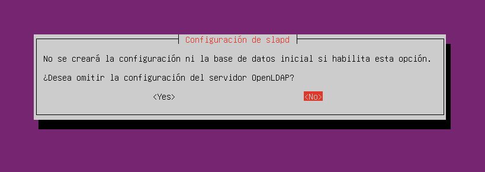
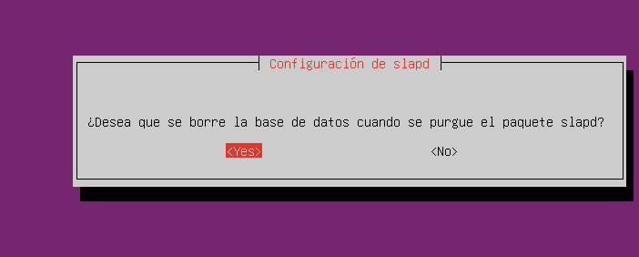
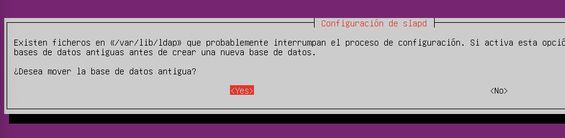
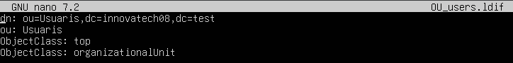
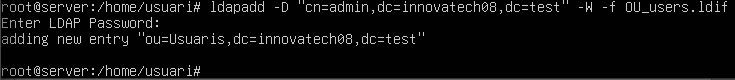
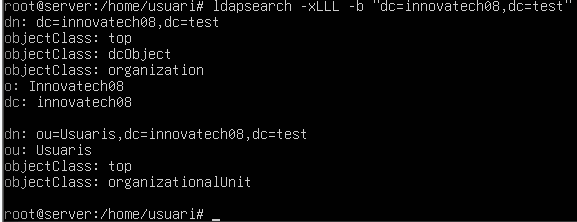

# UD4.AA2 Instal·lació OpenLDAP

---

Configurem el nom del servidor perque tingui nom de domini

---

Per comunicar-se amb el client, configurarem el primer adaptador amb "Xarxa NAT", mentre que el segon adaptador el posarem en "Amfitrió" per la gestió web des de la màquina

---

Instal·lem el servei LDAP i les seves utilitats per fer proves

---

Comprovem que el servei esta funcionant amb la comanda **"systemctl status slapd"**

---

--

Comprovem que el directori s'ha creat amb el nom correcte, en cas que ens haguem equivocat en la configuració, amb la comanda **"dpkg-reconfigure slapd"**, podem tornar a configurar el nom que volem, en cas que no haguem fet bé la configuració anterior. Si podem la comanda, haurem de segui la següent configuració per posar el nom del domini correctament

---

El format *.ldif* es el predeterminat per declarar objectes al directori. **"ldapadd"** Permet afegir elements al directori que li indiquem en la comanda

---

**"ldapsearch"** Serveix per fer consultes i buscar dins del directori que li indiquem en la comanda

---

### Altres Comandes. ***"ldap-utils"***
- **ldapdelete:** Per eliminar objectes dins del directori que li inf¡diquem en la comanda, també es po teliminar el propi directori amb aquesta utilitat
- **ldappasswd:** Serveix per canviar la contrassenya d'un usuari
- **ldapmodify:** Serveix per editar una entrada ja existent dins del directori

---

# UD4.AA3 Configuració directori usant LAM

---
