# UD4.AA2 Instal·lació OpenLDAP

---

Configurem el nom del servidor perque tingui nom de domini

---

Per comunicar-se amb el client, configurarem el primer adaptador amb "Xarxa NAT", mentre que el segon adaptador el posarem en "Amfitrió" per la gestió web des de la màquina

---

Instal·lem el servei LDAP i les seves utilitats per fer proves

---

Comprovem que el servei esta funcionant amb la comanda **"systemctl status slapd"**

---

--

Comprovem que el directori s'ha creat amb el nom correcte, en cas que ens haguem equivocat en la configuració, amb la comanda **"dpkg-reconfigure slapd"**, podem tornar a configurar el nom que volem, en cas que no haguem fet bé la configuració anterior. Si podem la comanda, haurem de segui la següent configuració per posar el nom del domini correctament

---

El format *.ldif* es el predeterminat per declarar objectes al directori. **"ldapadd"** Permet afegir elements al directori que li indiquem en la comanda

---

**"ldapsearch"** Serveix per fer consultes i buscar dins del directori que li indiquem en la comanda

---

### Altres Comandes. ***"ldap-utils"***
- **ldapdelete:** Per eliminar objectes dins del directori que li inf¡diquem en la comanda, també es po teliminar el propi directori amb aquesta utilitat
- **ldappasswd:** Serveix per canviar la contrassenya d'un usuari
- **ldapmodify:** Serveix per editar una entrada ja existent dins del directori

---

# UD4.AA3 Configuració directori usant LAM

---

Descarregan directament el paquet sencer del gestor, s'ens descarregaràn totes les dependències necessaries

---

Anirem al nostre buscador (Google) i cercarem *"http://IP de la màquina/lam"* i entrarem en el manager

---

Seleccionarem la pestanya de la configuració de lam i anirem a l'opció de **"Editar perfils dels sevidor"**

---

Iniciarem sessió amb el compte de lam i la contrasenyaserà el mateix que el nom d'usuari

---

La configuració comença a les preferències del servidor, on només haurem de tocar l'ultim apartat, el de **"Llista d'usuaris valids"**. El que haurem de configurar aqui és el *"cn"* i el domini. Hauria de quedar alguna cosa aixì: ***cn=admin,dc=innovatech08,dc=test

---

Configurarem l'idioma i posarem el que vulguem

---

A la configuració d'eines, el que haurem de tocar es el sofix de l'arbre, on haurem de posar el nostre domini; ***innovatech08.test***

---

Després haurem d'anar als tipus de comptes actius i en el *sufix LDAP*, posarem el nom que vam configurar la *ou* que vam configurar en la nostra terminal de la màquina virtual en el apartat dels usuaris. També, darrere de la "ou" posarem el nostre domini

---

Farem el mateix en el apartat dels grups, també posarem el domini que tinguem i la "ou" que haguem configurat en el fitxer de la màquina virtual

---

Quan ja tinguem tot el lam configurat correctament, haurem d'iniciar sessió normal amb el compte d'admin i la contrasenya **p@ssw0rd""

---

El primer cop que iniciem sessió després de configurar el lam, ens apareixerà aquest avis dient-nos que els sufixos no estan creats i que si els volem crear autoiomàticament. Per continuar, acceptarem l'opció de crear els tipus de compte que haguem configurat anteriorment

---

Anirem a la pestanya de datl a la dreta, en el aparta de **Comptes**, i seleccionarem una de les dues opcions que hi ha. (usuaris o grups)

---

Per configurar un nou grup, anirem a ***"Crear grup nou"***

---

S'ens obrirà la configuració i haurem de posar les dades que ens demanes correctament com les vulguem tenir. Ens demanarà el *nom del grup*, el *numero GID*, que ens permetrà organitzar i identificar els usuaris en grups autimàticament, i la descripció del grup

---

Quan ja tinguem el grup configurat correctament, el guardarem i tornarem a la pagina dels grups per veure que s'hagi creat amb al nostra configuració

---

Seguidament, anirem als Usuaris i farem exactament el mateix.

---

Crearem un nou usuari i omplirem les dades que s'ens demanen per crear-lo. Ens demana *nom*, *cognom* i *inicials*

---

Després, anirem a la pestanya de ***Unix*** de l'esquerra i configurarem els camps que ens demanen: *nom d'usuari*, *nom comú*, *número UID* que serveix per identificar l'usuari ràpidament, ja que és únic, i *directori inicial*

---

Abans de guardar l'usuari, li establirem una contraseña per iniciar sessió, l'acceptarem, i guardarem l'usuari. I ja tindrem el *"lam* completament configurat i haurem acabat amb la segona part de la pràctica

---

# UD4.AA4 Autentificació utilitzatnt LDAP

---

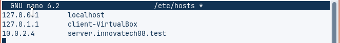

El primer que farem es configurar el nom del client per tal que tingui el domini corresponent al del directori. Posarem el nostre domini en el fitxer de ***"nano /etc/hosts"*** i el guardarem

---

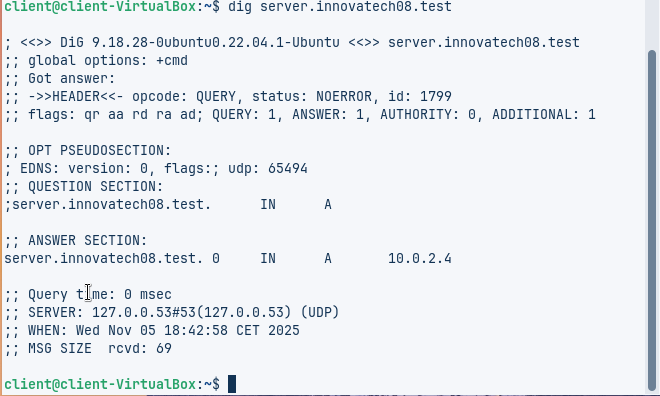

Amb la comanda ***"dig sever.innovatech08.test"*** comprovarem que els noms funcionen correctament

---

Instalarem els mòduls necessaris per poder utilitzar *libpam* i *nss*. Per fer-ho, escriurem la següent comanda: ***apt install libnss-ldap ldap-utils nscd -y***

---

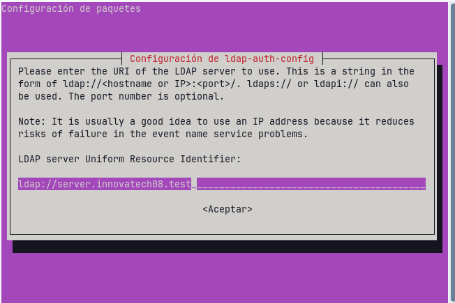

En entrar la comanda d'isntal·lació, començarem amb la configuració del LDAP. Posarem el nostre domini en la casell i li donarem a acceptar per continuar

---

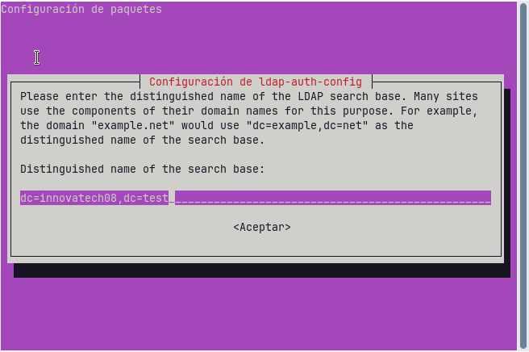

El següen que s'ens demana es un altre cop el nostre domini, quan el tinguem escrit, acceptarem i continuarem

---

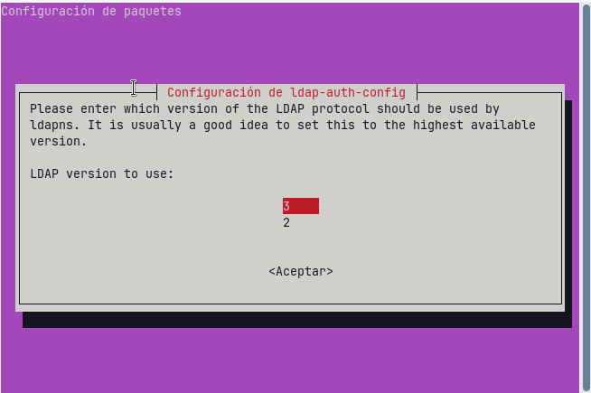

Aquesta pantalla la deixarem exactament tot com està i continuarem

---

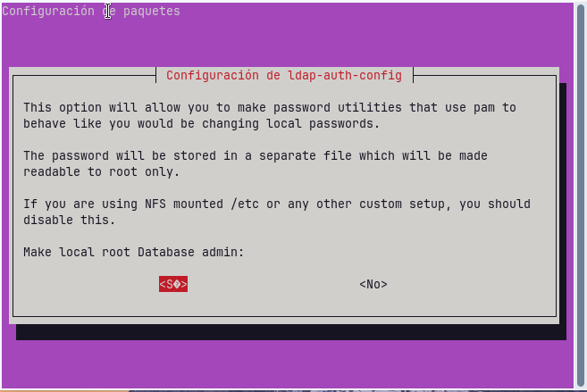

Seleccionarem l'opció de *si* i continuarem

---

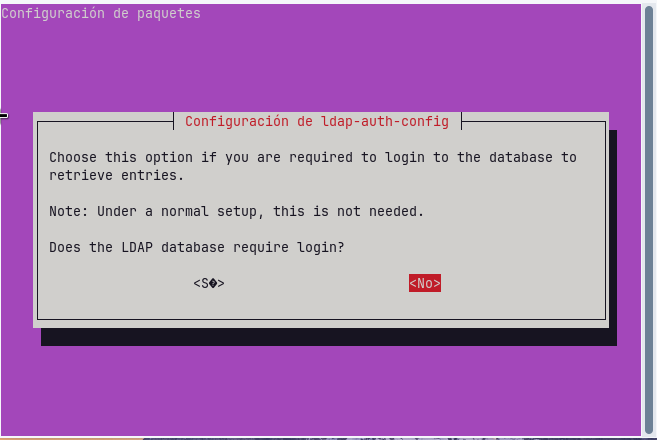

I en aquesta seleccionem *no* i continuem

---

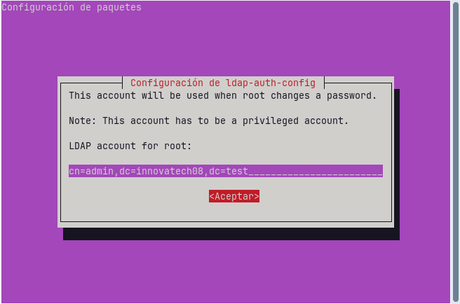

Aqui configurem el compte LDAP del root: (admin) i el domini

---

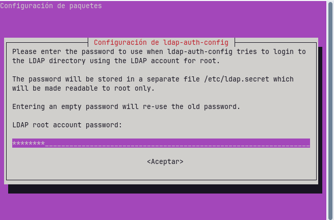

I ficarem la contrasenya del compte de LDAP

---

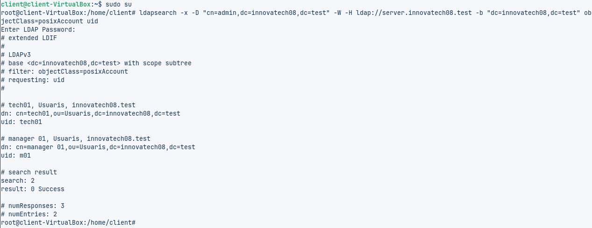

Amb aquesta comanda el que estem fent és fer una consulta LDAP des del client per comprovar si es connecta correctament amb el servidor

---

Editarem el fitxer ***nano nsswitcc.conf*** per indicar que usarem LDAP per usuaris i grups

---

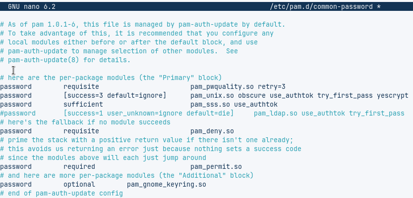

I després anirem al fitxer ***nano /etc/pam.d/common-password*** i eliminem la linia que conte el terme **use_authtok**

---

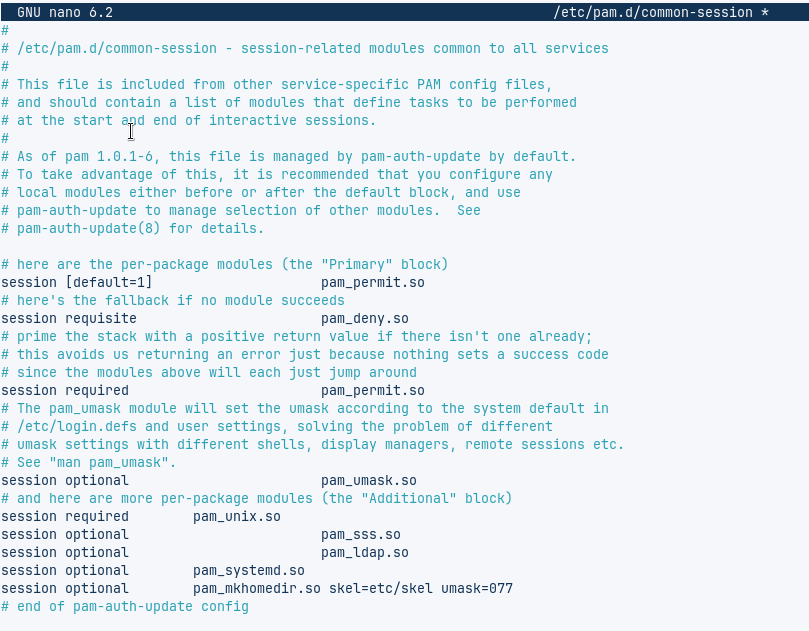

Haurem d'editar un altre fitxer, concretament el ***nano /etc/pam.d/common-session*** i afegirem la linia per crear els perfils

---

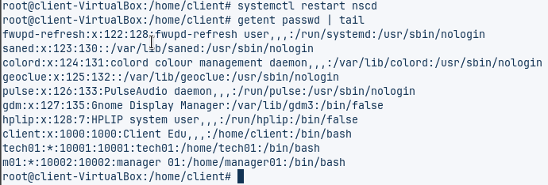

Reiniciem el servei amb la comanda ***systemctl restart nscd***, i seguidament escriurem la comanda ***getent passwd | tail*** per comprovar que el servei veu els usuaris LDAP

---

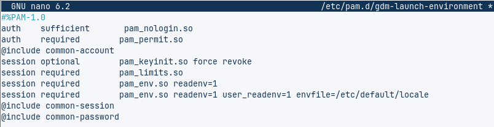

Per acabar, editarem el fitxer ***nano /etc/pam.d/gmd-launch-environment*** per permentre l'inici de sessió gràfica

---

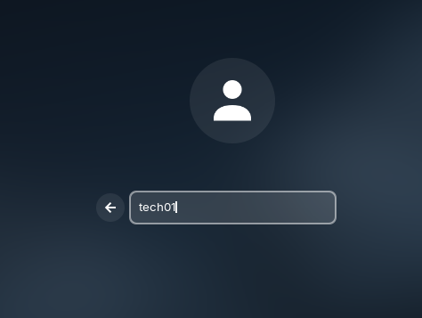

Reiniciem el client i iniciem sessió amb l'usuari **tech01**

---

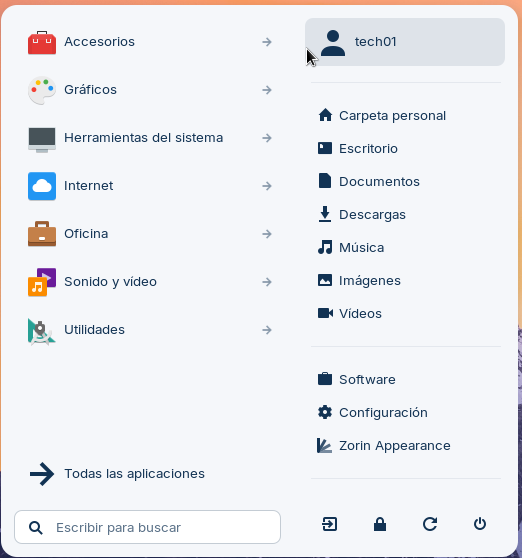

Com podem veure, l'usuari i la carpeta personal s'han creat correctament

---

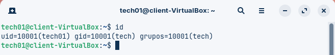

Per assegurar-nos del tot, podem entrar en la terminal i escriure **"id"**, i ens sortirà si l'usuari està creat correctament i en el grup correcte

---

I això serìa tota la pràctica de LDAP
