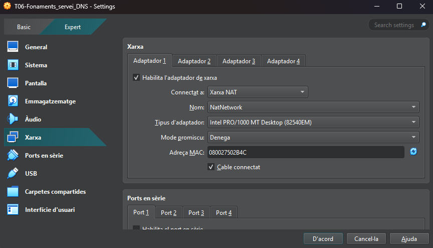

Treballarem amb dues interfícies, aixi que activarem dos adaptadors

---
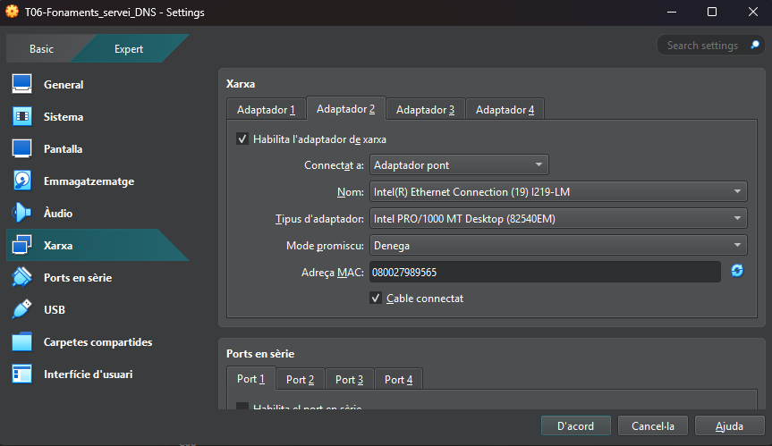

El primer adaptador el posarem en "Xarxa NAT" i el segon el posarem en "Adaptador de pont i ens assegurarem que la IP estigui configuradad correctament

---
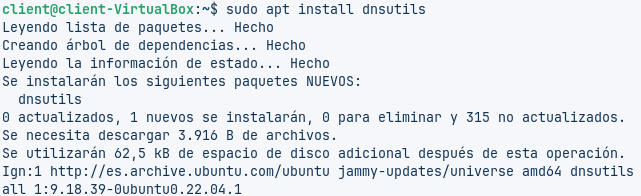

Instal·larem els utils del DNS amb la comanda "apt install dnsutils"

---
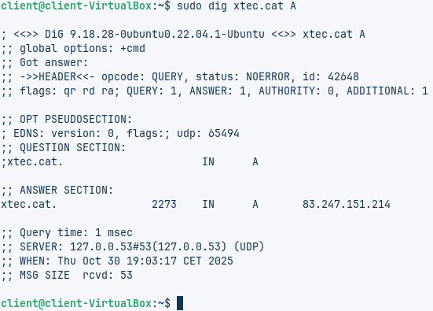

Fem la següent comanda **"dig xtec.cat A"**. I ens dona els següents resultats:
- IP: 83.247.151.214
- V. TTL: 2273
- Servidor: 127.0.0.53

---
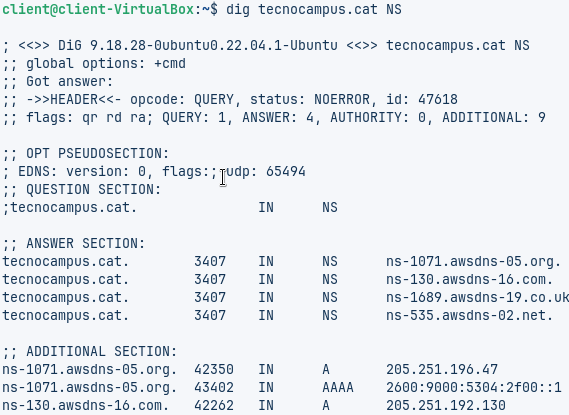

Introduïm la comanda **"dig tecnocampus.cat"** i veiem que els servidors autoritatius són els que surten en la "ANSWER SECTION"

---
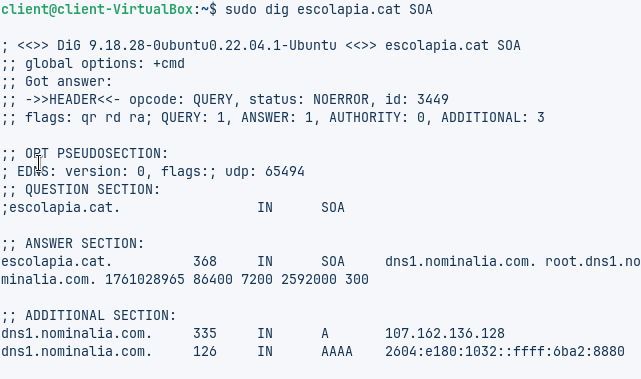

Amb la comanda **"dig escolapia.cat SOA"** podem veure quin servidor es el que té autoritat sobre el domini. El que ens ho permet veure es l'argument "SOA"

---
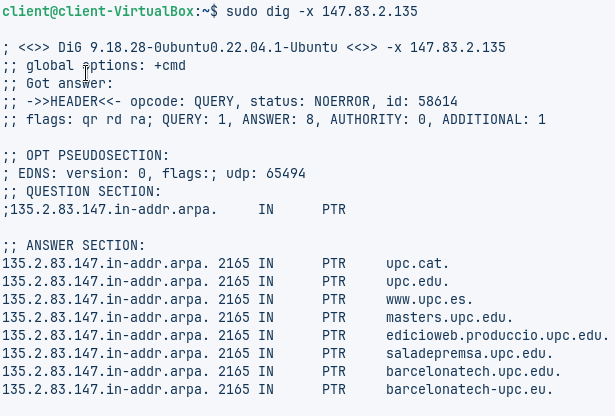

Aquesta comanda permet fer una cerca inversa, es a dir, ens permet veure quin domini està assignat a una IP especifica

---
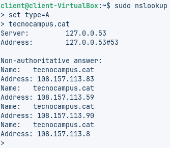

D'aquesta manera podem configurar el *nslookup* perque ens cerqui la IP del domini que li indiquem en el registre. ***Registre A***

---
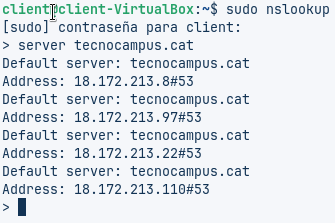

Aixi podem canviar el servidor DNS al servidor que li indiquem al *lookup*

---
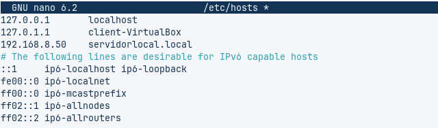

En el arxiu dels hosts **("nano /etc/hosts")**, aplicarem una IP assignada al servidor local i la guardarem

---
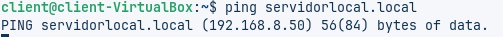

Seguidament, al fer la comanda **"ping + *domini servidor local*"**, obtindrem la IP que li hem assignat en el fitxer dels hosts

---
