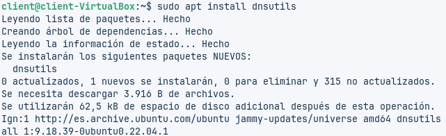
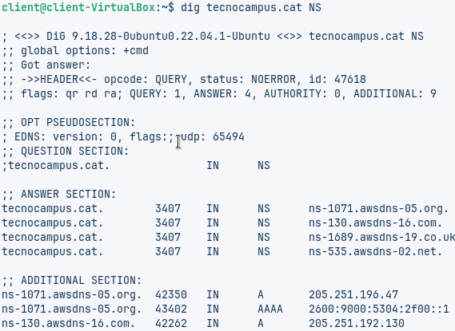
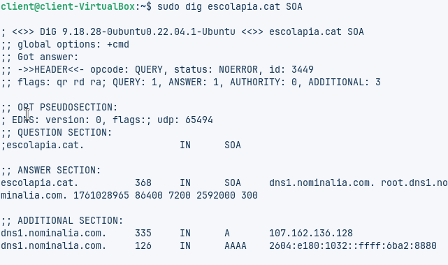
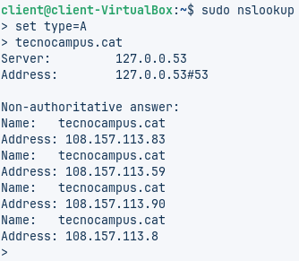
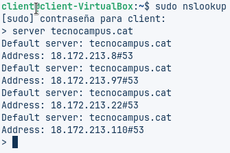

Treballarem amb dues interfícies, aixi que posarem dos adaptadors
---

El primer adaptador el posarem en "Xarxa NAT" i el segon el posarem en "Adaptador de pont i ens assegurarem que la IP estigui configuradad correctament

---

Instal·larem els utils del DNS amb la comanda "apt install dnsutils"

---

Fem la següent comanda "dig xtec.cat A". I ens dona els següents resultats:
- IP: 83.247.151.214
- V. TTL: 2273
- Servidor: 127.0.0.53

---

Introduïm la comanda "dig tecnocampus.cat" i veiem que els servidors autoritatius són els que surten en la "ANSWER SECTION"

---

Amb la comanda **"sig ecolapia.cat SOA"**

---

info

---

info

---

info

---

info

---

info

---
